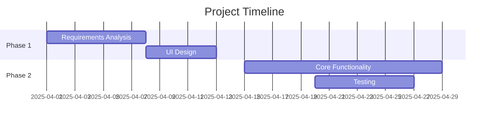

# Word Memory Master - Vocabulary Learning Application

## Table of Contents
- [Project Purpose](#project-purpose)
- [Features](#features)
- [Graphical User Interface](#graphical-user-interface)
- [Installation](#installation)
- [Usage](#usage)
- [Software Development Process](#software-development-process)
- [Technical Specifications](#technical-specifications)
- [Team & Contributions](#team--contributions)
- [License](#license)

# Project Purpose
This application addresses three key challenges in language learning:
1. **Inefficient memorization** - Implements spaced repetition algorithm
2. **Lack of engagement** - Interactive GUI with progress tracking
3. **Limited accessibility** - Lightweight, cross-platform solution

**Development Methodology**: We adopted Agile methodology with 2-week sprints to allow for iterative improvements based on user feedback.

## Features

✔️ **Core Functionality**
- Dynamic word flashcards
- Score tracking system
- Customizable word libraries

✔️ **Advanced Features**
- Difficulty-based word selection
- Mistake highlighting
- Performance analytics

## Graphical User Interface


## Installation

### Requirements
| Component | Specification |
|-----------|--------------|
| Python | 3.8+ |
| OS | Windows/macOS/Linux |
| Memory | 512MB RAM |
| Storage | 50MB |

```bash
# Clone repository
git clone https://github.com/username/WordMemoryMaster.git

# Install dependencies
pip install -r requirements.txt
```

## Usage

```python
python main.py
```

**Basic Operations**:
1. Type translation in input box
2. Press Enter to submit
3. View immediate feedback
4. Track progress via score panel

## Software Development Process

### Development Timeline


### Key Components
1. **Frontend**
   - Tkinter-based GUI
   - Responsive layout manager

2. **Backend**
   - Word processing engine
   - Scoring algorithm
   - Data persistence layer

3. **Data Management**
   - JSON-based storage
   - Import/export functionality

### Testing Strategy
- Unit tests for core algorithms
- Integration tests for UI components
- User acceptance testing

## Technical Specifications

### System Architecture
WordMemoryApp/

├── main.py             
├── words.json          
├── requirements.txt   
└── README.md           
### Dependencies
| Package | Version | Purpose |
|---------|---------|---------|
| tkinter | 8.6 | GUI Framework |

## Team & Contributions

Tommy张博文p2321213
Steven杨旸p2320960
oak张津豪p2320152
## License


**Declaration**: This application utilizes open-source components under their respective licenses. All original code was developed by our team following agile process. Third-party resources are properly attributed in the source code and documentation.
